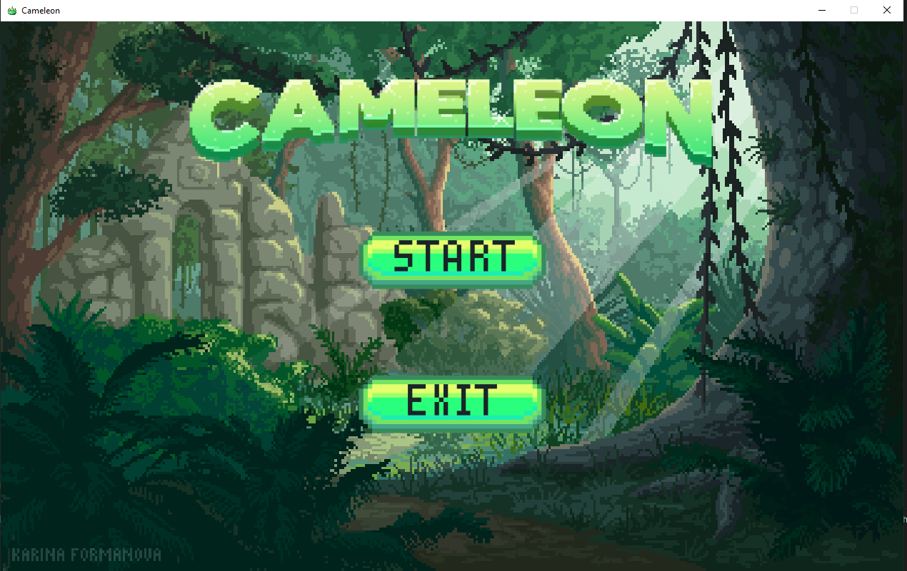
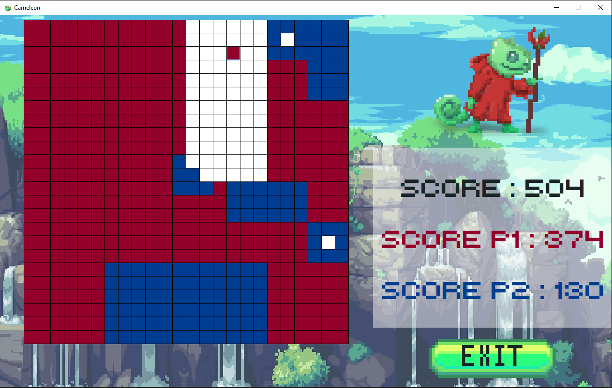

## University project for the module X31I020

The goal of this project and rules of the game are explained in -->  `/docs/Projet.pdf`. This project was developed using Intellij and openjdk-17
This project implement a PR-Quadtree data structure with insertion and search in O(log2 n) for the time complexity and O(k log2 n) for the space complexity.

*This code could be refactored and improved, especially the UI part, but as we were not evaluated on it, we didn't and won't do it*

**Authors:**
- faceslog (https://github.com/faceslog)
- orianne-grd (https://github.com/orianne-grd)